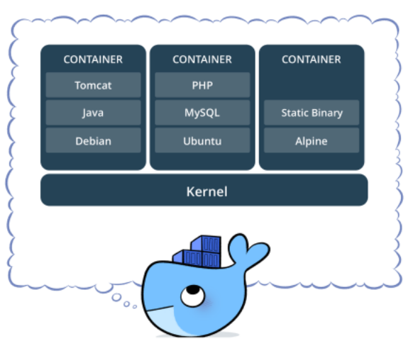
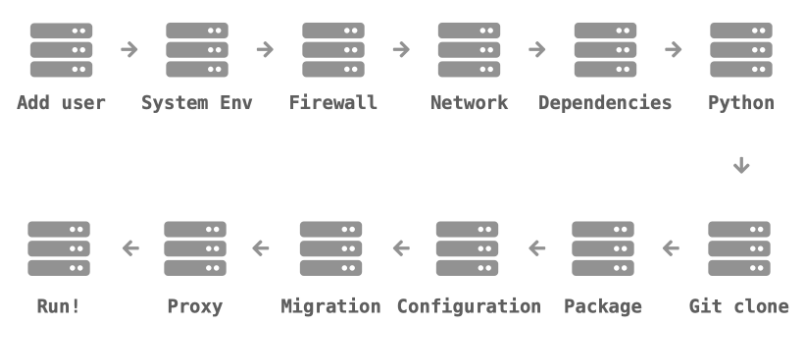
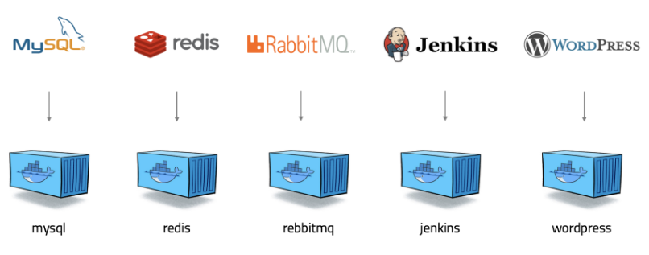
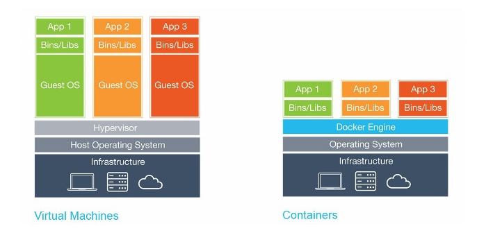

# 도커란 무엇인가?

> **Docker**

- **컨테이너 기반의 오픈소스 가상화 플랫폼**
- 모든 것을 컨테이너로!! 만들 수  있다.

---

- 서버를 관리한다는 것
  - 내부적으로 서버관리는 매우 복잡하다. 
    - 프로그램 설치가 어렵거나 서버 또는 개발 환경이 바뀔 수 있다.
  - 기존의 서버 관리 방식
  

- **도커** 의 등장 후 서버관리 및 개발 방식이 완전히 변화하였다. (**컨테이너** 방식)
  - 어떤 프로그램도 컨테이너로 만들 수 있다. (MySQL, Redis, RabbitMQ, Jenkins 등 서로 다른 프로그램을 컨테이너라는 공통적인 형태로 만들 수 있다.)
  - 컨테이너를 만들어 두면 어디서든 돌아간다.
    - **컨테이너** : 격리된 환경에서 작동하는 프로세스
    - 리눅스 커널의 여러 기술을 활용
    - **이미지 단위** 로 프로세스 실행환경을 구성
    - 하드웨어 가상화 기술보다 가벼움
  - 가산머신처럼 독립적이지만, 더 빠르고 쉽고 효율적이다.
  - 도커의 서버 관리 방식
  
  
---

> **Docker 의 특징**

- virtual machine의 경우 Hypervisor을 통해 가상화 기능을 제공 (각각 독립된 커널 공간을 가진 OS를 생성)
- 도커는 가상머신이 아니라 격리만 해주기 때문에 성능면으로 하락이 없다. (오버헤드 X)
- 도커는 같은 커널 공간을 공유하며 같은 가상화 기능 제공 >> 좀 더 가볍다.

- **확장성과 이식성이 좋다.**
  - 도커가 설치되어 있다면 어디서든 컨테이너를 실행할 수 있다.
  - 특정 회사나 서비스에 종속적이지 않다. (오픈소스)
  - 배포뿐만이 아니라 쉽게 개발서버를 만들 수 있고, 테스트 서버 생성도 편하다.

- **표준성**
  - 애플리케이션은 각각 배포 방식이 다르다.
  - 컨테이너 라는 표준으로 서버를 배포하므로 모든 서비스들의 배포 과정이 동일해진다.

- **이미지**
  - 컨테이너를 실행하기 위한 압축파일
  - 이미지에서 컨테이너를 생성하기 때문에 반드시 이미지를 만드는 과정이 필요하다.
  - **Dockerfile** 을 이용하여 만든다.
  - 빌드 서버에서 이미지를 만들면 해당 이미지를 이미지 저장소에 저장하고 운영서버에서 불러온다. (필요한 곳에 가져다 쓸 수 있다.)
  - 빌드 기록이 남는다
  

- **설정관리**
  - 보통 환경변수로 제어
  - MYSQL_PASS=password 와 같이 컨테이너를 띄울 때 환경 변수를 같이 지정한다.
  - 하나의 이미지가 환경변수에 따라 동적으로 설정파일을 생성하도록 만들어야 한다.

- **자원관리**
  - 컨테이너는 삭제 후 새로 만들면 모든 데이터가 초기화 된다.
  - 업로드 파일을 외부 스토리지와 링크하거나, 볼륨 설정, S3 같은 별도의 저장소가 필요하다.
  - 세션이나 캐시를 Redis와 같은 외부로 분리

---

> **Kubernetes**

- 여러대의 서버와 여러개의 서비스를 쉽게 관리해주는 것
- 쿠버네티스 내부에 여러 도커가 존재한다.

---

> **Kubernetes 대표 기능**

- **스케줄링**
  - 컨테이너를 적당한 서버에 배포하는 작업
  - 여러 대의 서버 중 가장 할일 없는 서버에 배포하거나, 그냥 차례대로 배포 또는 랜덤 배포한다.
  - 컨테이너 개수를 여러 개로 늘리면 적당히 나눠 배포하고, 서버가 죽으면 실행 중인 컨테이너를 다른 서버에 띄워준다.
  

- **클러스터링**
  - 여러개의 서버를 하나의 서버처럼 사용
  - 작게는 몇개 안되는 서버부터 많게는 수천대의 서버를 하나의 클러스터로 관리
  - 흩어져 있는 컨테이너도 가상 네트워크를 이용해 마치 같은 서버에 있는 것처럼 쉽게 통신

- **서비스 디스커버리**
  - 서비스를 찾아주는 기능 (서버 간에 연결 시)
  - 클러스터 환경에서 컨테이너는 어느 서버에 생성될지 알 수 없고, 다른 서버로 이동할 수도 있다.
  - 따라서 컨테이너와 통신을 하기 위해 어느 서버에서 실행 중인지 알아야 하고, 컨테이너가 생성되고 중지될 때 어딘가에 IP와 Port 같은 정보를 업데이터 해야한다.
  - Key-Value Storage 에 정보를 저장할 수도 있고, 내부 DNS 서버를 이용한다. (도커 컨테이너명으로 바로 접근)