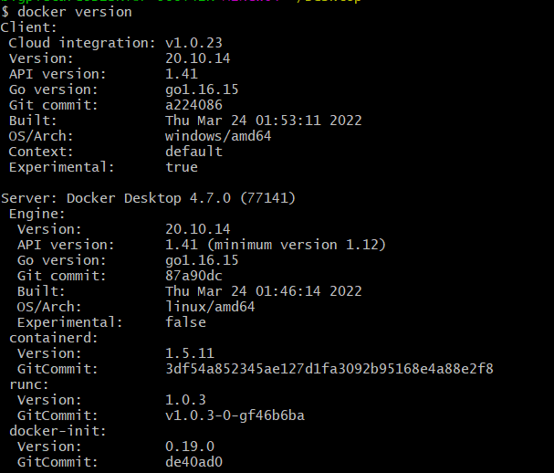
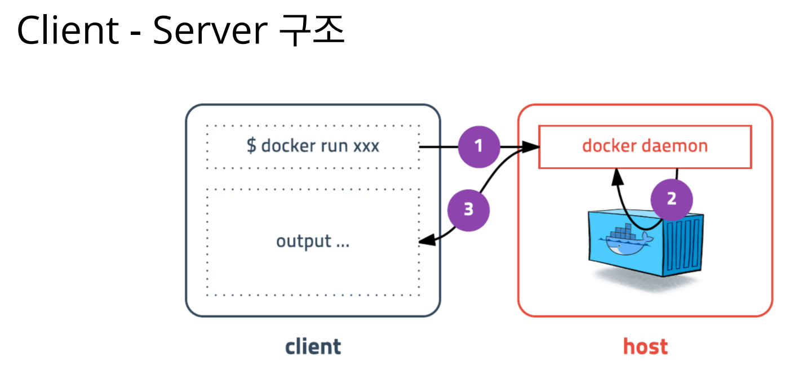
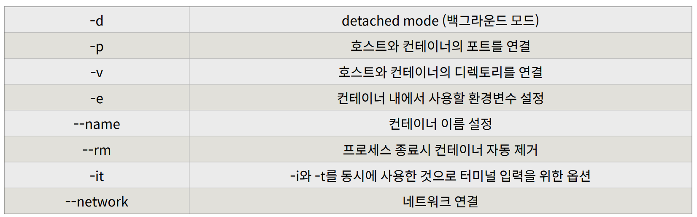

# 도커 설치부터 실행까지

> **도커 설치**

- Linux : curl -s https://get.docker.com/ | sudo sh
- ubuntu : sudo usermod -aG docker ubuntu (유저 권한 추가)
- Docker for Window / Mac Download (가장 쉽고 빠르게 설치)

- 설치 확인 : **docker version**

- 명령어를 입력한 곳이 Client
- Localhost 에 떠있는 도커가 Server

---

> **도커 기본 명령어**

- 도커 컨테이너 실행 : **run**
  - **docker run [OPTION] IMAGE[:TAG|@DIGEST] [COMMAND] [ARGS..]**
  
    

  
  - **docker run ubuntu:20.04**
    - run 명령어를 사용 후 사용할 이미지가 있는지 확인 후 없으면 다운로드 (pull) 한 후 컨테아너를 띄운다.
    - 컨테이너는 정상 실행되지만 명령어를 따로 전달하지 않아서 생성되자마자 종료된다.
    - 컨테이너는 프로세스 이기 때문에 실행중인 프로세스가 없으면 종료된다. 
    - 도커 이미지마다 컨테이나가 만들어질 때 실행할 명령어를 지정할 수 있다.
    - ubuntu:20.04 는 "/bin/bash" 가 지정되어 쉘이 실행되야 하지만, 입력 받을 수 있도록 "-it" 옵션을 입력하지 않아 바로 종료되었다.

  - **docker run --rm -it ubuntu:20.04 /bin/sh**
    - 컨테이너 내부에 들어가 sh를 실행하고 키보드 입력을 위해 -it 옵션을 준다.
    - 프로세스 종료 시 컨테이너 자동 삭제를 위한 --rm 옵션도 추가 한 것
    - --rm 옵션이 없다면 컨테이너 종료 후 삭제되지 않고 남아있어 수동으로 삭제해야 한다.
    - **$ winpty docker run --rm -it ubuntu:20.04 sh**

  - **docker run --rm -it centos:8 /bin/sh**
    - 다양한 리눅스 배포한을 실행할 수 있다.
    - 모두 동일한 커널을 사용
    - Ubuntu 또는 CentOS에 포함된 다양한 기본기능이 필요 없는 경우 Alpine 이라는 초소형 이미지를 사용할 수도 있다.

  - **docker run --rm -d -p 5678:5678 hashicorp/http-echo -text="hello world"**
    - 웹 어플리케이션 실행
    - -d : 백그라운드 실행
    - -p : 컨테이너 포트를 호스트 포트로 연결
    - curl localhost:5678

  - **docker run --rm -p 1234:6379 redis**
    - redis 실행하기

  - **docker run -d -p 3306:3306 -e MYSQL_ALLOW_EMPTY_PASSWORD=true --name mysql mysql:5.7**
    - password 입력 없이 mysql 실행하기
    - --name : 특정 이름을 지정
    - **docker exec -it mysql mysql**
      - mysql 이라는 이름으로 접속 후 mysql 명령어 실행하기
      - 워드프레스 실습을 위한 mysql 설정
        - create database wp CHARACTER SET utf8; \
          grant all privileges on wp.* to wp@'%' identified by 'wp'; \
          flush privileges; \
          quit

  - **exec 명령어**
    - 실행중인 도커 컨테이너에 접속할 때 사용
    - 컨테이너 안에 ssh server 등을 설치하지 않고 exec 명령어로 접속
  - 도커는 다양한 데이터베이스를 손쉽게 생성/삭제할 수 있어 개발 시 많이 사용된다.

  - **docker run -d -p 8080:80 \
    -e WORDPRESS_DB_HOST=host.docker.internal \
    -e WORDPRESS_DB_NAME=wp \
    -e WORDPRESS_DB_USER=wp \
    -e WORDPRESS_DB_PASSWORD=wp \
    wordpress**
    - 워드프레스 블로그 실행하기 (앞에서 만든 MySQL을 실행한 상태에서 생성)
    - localhost:8080

---

- **ps 명령어**
  - **docker ps** 
    - 실행중인 컨테이너 목록을 확인하는 명령어~
  - **docker ps -a**
    - 중지된 컨테이너도 확인하려면 -a 옵션을 붙인다.

- **stop 명령어**
  - **docker stop [OPTIONS] CONTAINER [CONTAINER...]**
    - 실행중인 컨테이너를 중지하는 명령어
    - 하나 또는 여러개(띄어쓰기) 중지할 수 있다.

- **rm 명령어**
  - **docker rm [OPTIONS] CONTAINER [CONTAINER...]**
    - 중지된 컨테이너를 완전히 제거하는 명령어

- **logs 명령어**
  - **docker logs [OPTIONS] CONTAINER**
    - 컨테이너가 정상적으로 동작하는지 로그를 확인하는 것
    - -f : 대기하면서 추가로그가 생기면 보여준다.
    - --tail [line] : 아래에서 지정한 줄까지 로그를 보여준다. 

- **images 명령어**
  - **docker images [OPTIONS] [REPOSITORY[:TAG]]**
    - 도커가 다운로드한 이미지 목록을 보는 명령어

- **pull 명령어**
  - **docker pull [OPTIONS] NAME[:TAG|@DIGEST]**
    - 이미지를 다운로드하는 명령어 (docker pull ubuntu:18.04)

- **rmi 명령어**
  - **docker rmi [OPTIONS] IMAGE [IMAGE...]**
    - 이미지를 삭제하는 방법 (컨테이너가 실행중인 이미지는 삭제 X)

- **network create 명령어**
  - docker network create [OPTIONS] NETWORK
    - 도커 컨테이너끼리 이름으로 통신할 수 있는 가상 네트워크를 만든다.
    - wordpress와 mysql이 통신할 네트워크 생성하기
      - docker network create app-network

- **network connect 명령어**
  - **docker network connect [OPTIONS] NETWORK CONTAINER**
    - 기존에 생성된 컨테이너에 네트워크를 추가
    - mysql 컨테이너에 네트워크를 추가하기
      - docker network connect app-network mysql

- **network option 명령어**
  - docker run -d -p 8080:80 \
    --network=app-network \
    -e WORDPRESS_DB_HOST=mysql \
    -e WORDPRESS_DB_NAME=wp \
    -e WORDPRESS_DB_USER=wp \
    -e WORDPRESS_DB_PASSWORD=wp \
    wordpress
    - 워드프레스를 app-network에 속하게 하고 mysql을 이름으로 접근

---

- **volume**
  - 컨테이너를 껏다가 키면 안에 데이터가 전부 사라진다.
  - **volume mount (-v) 명령어**
    - mysql을 삭제후에 다시 실행하면 데이터베이스 오류가 발생
    - -v 옵션을 통해 내 디렉토리를 컨테이너의 디렉토리에 연결을 시켜 데이터를 유지할 수 있다.
    - **-v /my/own/datadir:/var/lib/mysql**
    - **docker stop mysql
      docker rm mysql
      docker run -d -p 3306:3306 \
      -e MYSQL_ALLOW_EMPTY_PASSWORD=true \
      --network=app-network \
      --name mysql \
      -v /Users/subicura/Workspace/github.com/subicura/docker-guide/ch02/mysql:/var/lib/mysql \
      mysql:5.7**
      

---

> **도커 컴포즈**

- **docker-compose version** 
  - 설치 / 버전 확인

- **docker-compose.yml** 을 사용하여 쉽고, 이해하기 쉽고, 가독성 좋게 컨테이너를 띄울 수 있다.

- **docker-compose up -d**
  - docker compose를 이용하여 컨테이너 띄우기
  - 자동으로 docker-compose.yml 파일을 읽어서 컨테이너를 생성한다.

- **docker-compose down**
  - docker compose를 이용하여 컨테이너 종료하기

---

> **그 외 도커 컴포즈 문법**

- 자료 참조
