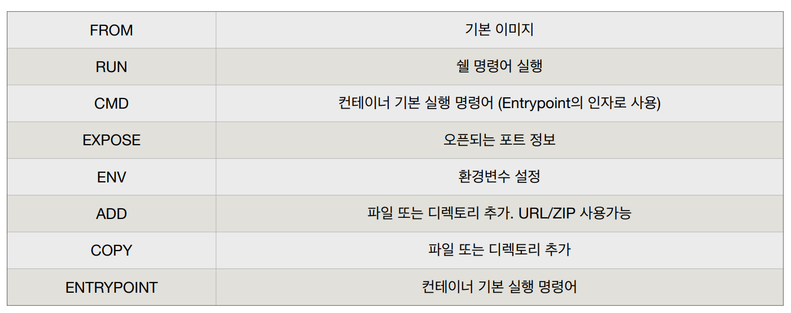
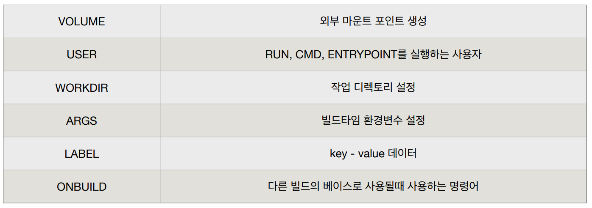

# Docker Image

- 이미지는 프로세스가 실행되는 파일들의 집합(환경)
- 어떠한 서버 환경을 저장해서 이미지로 만든다.

---

> **도커 이미지 생성**

- docker build -t [이름]/[이미지이름]:[태그] [빌드컨텍스트]
- docker build -t subicura/ubuntu:git01 .
- -t : 도커 이미지 이름 지정
- 빌드 컨텍스트 위치는 현재 디렉터리를 주로 사용한다.

---

> **Dockerfile**

