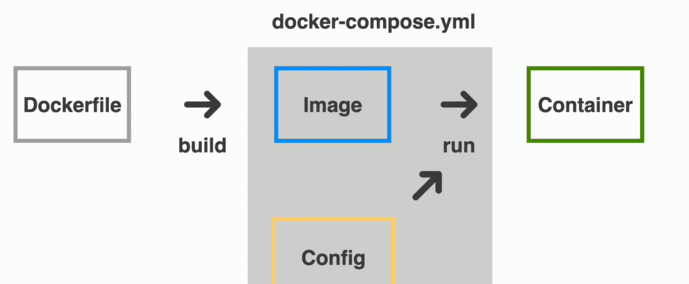
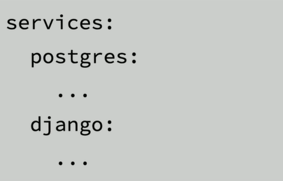
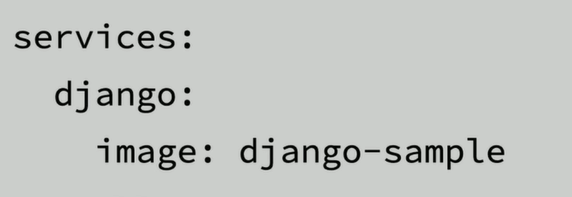
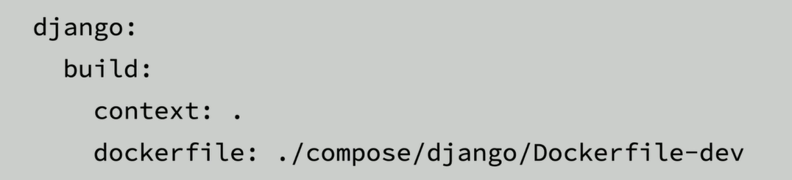
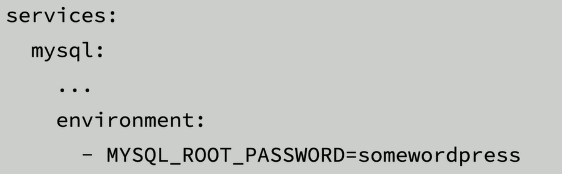

# 도커 컴포즈

## 도커 컴포즈란?

- Fig -> Docker compose

  
- 여러 컨테이너도 한꺼번에 관리 가능
- 여러개의 컨테이너를 하나로 묶어주는 역할을 하는 툴

---

### 도커 컴포즈의 장점

- 도커 실행 명령어를 대체할 수 있다.
- 컨테이너 연결이 편리하다.
- 특정 컨테이너만 공유하는 네트워크

---

### YAML syntax

- 확장자는 .yml
- 키와 값은 : 기호 (Dictionary)
- 블록 내에선 두 칸 들여쓰기 적용
- 목록은 - 기호
- 주선은 # 기호

- **version**
    - docker-compose.yml 파일의 명세 버전
    - 버전에 따라 지원하는 도커 엔진 버전도 다르다.

- **services**
    - 실행할 컨테이너 정의
    - docker run --name test 와 같음
  
    
    

- **image**
    - 컨테이너에 사용할 이미지 이름과 태그
    - 태그 생략 시 latest (이미지 없으면 자동 pull) 
  
    
      

- **build**
    - 이미지 자체 빌드 후 사용
    - image 속성 대신 사용
    - 별도의 도커파일이 필요하다.
  
    

- **port**
    - 컨테이너와 연결할 포트들을 지정
    - {host port}:{container port}
  
    
      

- **environment**
    - 컨테이너에서 사용할 환경변수들을 지정
    - {환경변수 이름}:{값}
  
    

- **volumn**
    - 마운트 하려는 디렉터리들을 지정
    - {host dir}:{container dir}
  
    
      

- **link**
    - 다른 컨테이너와 연결   
    - 도커 컴포즈 내부에선 모든 컨테이너가 연결될 수 있어서 잘 사용은 안한다.
    - {연결할 컨테이너 이름}:{해당 컨테이너에서 참조할 이름}
  
    
      

- **depends_on**
    - 컨테이너 의존성 추가
    - 컨테이너의 실행순서
  
    

---

### 도커 컴포즈 명령어

> 도커 컴포즈로 실행 및 종료

- docker-compose up -d : 실행
  - --build : 강제로 이미지 빌드
  - --force-recreate : 컨테이너 새로 생성
  - -d : 데몬 모드
- docker-compose down : 종료
- docker-compose pull [service] : 필요한 이미지 다운
- docker-compose build [service] : 필요한 이미지 빌드 
- docker-compose ps : 현재 실행중인 서비스 목록 보기
- docker-compose logs [service] : 로그 보기 
  - -f : 로그 계속보기
- docker-compose top : 서비스 내에서 실행중인 프로세스 목록 보기
- docker-compose stop [service] : 실행중인 서비스 중지
- docker-compose start [service] :  중지된 서비스 컨테이너 실행
- docker-compose run [service] {command} : 해당 서비스에 컨테이너를 하나 더 실행
  - -e : 환경변수 설정
  - -p : 포트 설정
  - --rm : 컨테이너 종료 시 자동 삭제
- docker-compose exec {container} {command} : 해당 서비스의 컨테이너에서 명령어를 실행
  - -e : 환경변수 설정
- docker-compose down [service] : stop + kill => 서비스를 멈추고 컨테이너 삭제
  - -v : 도커 볼륨도 삭제